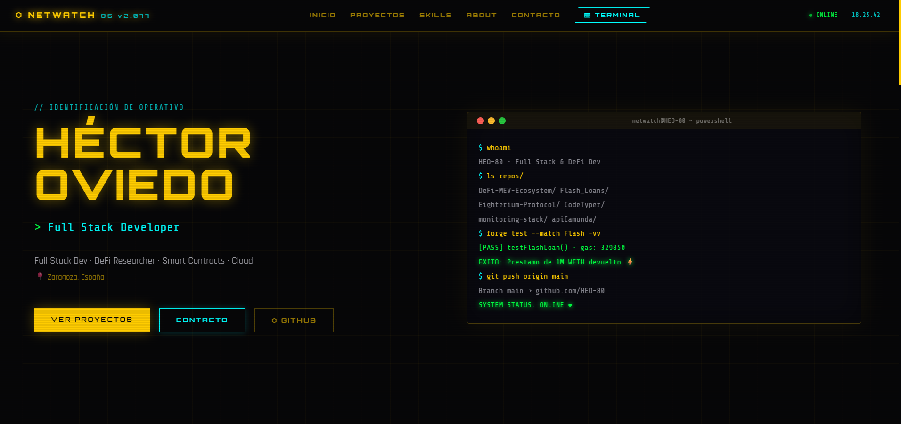
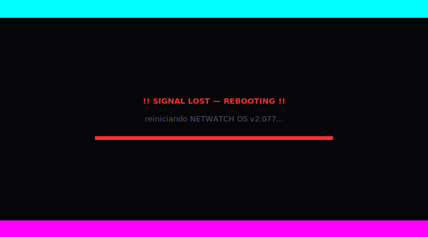

<pre>
██╗  ██╗███████╗ ██████╗        █████╗  ██████╗ 
██║  ██║██╔════╝██╔═══██╗      ██╔══██╗██╔═████╗
███████║█████╗  ██║   ██║█████╗╚█████╔╝██║██╔██║
██╔══██║██╔══╝  ██║   ██║╚════╝██╔══██╗████╔╝██║
██║  ██║███████╗╚██████╔╝      ╚█████╔╝╚██████╔╝
╚═╝  ╚═╝╚══════╝ ╚═════╝        ╚════╝  ╚═════╝ 

███╗   ██╗███████╗████████╗██╗    ██╗ █████╗ ████████╗ ██████╗██╗  ██╗
████╗  ██║██╔════╝╚══██╔══╝██║    ██║██╔══██╗╚══██╔══╝██╔════╝██║  ██║
██╔██╗ ██║█████╗     ██║   ██║ █╗ ██║███████║   ██║   ██║     ███████║
██║╚██╗██║██╔══╝     ██║   ██║███╗██║██╔══██║   ██║   ██║     ██╔══██║
██║ ╚████║███████╗   ██║   ╚███╔███╔╝██║  ██║   ██║   ╚██████╗██║  ██║
╚═╝  ╚═══╝╚══════╝   ╚═╝    ╚══╝╚══╝ ╚═╝  ╚═╝   ╚═╝    ╚═════╝╚═╝  ╚═╝
</pre>

# Héctor Oviedo

**Backend Developer · DeFi & Smart Contracts · Cloud Infrastructure**

 

⬆ Clic en las imágenes para ver el portfolio en vivo

---

### About me

Backend developer with 3-4 years of experience building fullstack applications, cloud-deployed services, and autonomous DeFi systems. I work mainly with **C# / .NET**, **Solidity**, and cloud infrastructure on **Azure and AWS**.

I also teach — I've run courses on HTML, CSS, JavaScript, React, Next.js, Astro and React Native. I believe that being able to explain something clearly is the highest level of understanding it.

Currently focused on **DeFi, Web3 and Cloud/DevOps**.

---

### Tech

**Blockchain & DeFi** — Solidity · Aave V3 · PancakeSwap · Flash Swaps · Foundry · Hardhat · Nethereum · BSC · Ethereum

**Backend** — C# · .NET · Clean Architecture · CQRS · REST APIs · PostgreSQL · Spring Boot · Camunda BPM

**Frontend** — React · Next.js · Astro · TypeScript · Tailwind · Angular · React Native · Flutter

**Cloud & Infra** — Azure · AWS · Docker · Prometheus · Grafana · Linux

**Data** — Power BI · Big Data

---

### Featured Projects

| | Project | Description |
|:---:|:---|:---|
| ⚡ | [DeFi-MEV-Ecosystem](https://github.com/HEO-80/DeFi-MEV-Ecosystem) | Central hub of a complete MEV system — Flash Loans · Multi-DEX arbitrage · Token sniping on BSC & Ethereum |
| 🐺 | [12_MultiTokenBrain](https://github.com/HEO-80/12_MultiTokenBrain) | MEV radar V5 — WebSocket low-latency scanner · Gas math · Dark Forest anti-sandwich routing |
| 🏹 | [13_SniperBot](https://github.com/HEO-80/13_SniperBot) | Autonomous MEV sniper on BSC — DexScreener · GoPlus honeypot detection · atomic swap |
| 🔄 | [11_MainnetFlashBot](https://github.com/HEO-80/11_MainnetFlashBot) | PancakeSwap Flash Swap — native AMM loan · pancakeCall · single block execution |
| 🧠 | [RealPriceBrain](https://github.com/HEO-80/10_RealPriceBrain) | Multi-DEX radar scanning price spreads and triggering flash loan arbitrage |
| ⚡ | [Flash_Loans](https://github.com/HEO-80/Flash_Loans) | Aave V3 receiver — atomic collateral-free operations on Ethereum Mainnet |
| 📊 | [monitoring-stack](https://github.com/HEO-80/monitoring-stack) | Full observability stack — Prometheus · Grafana · Docker · home lab |
| 🐘 | [docker-postgres-stack](https://github.com/HEO-80/docker-postgres-stack) | Dockerized PostgreSQL environment with Adminer web interface |
| 🌌 | [Takuya_Terminal_Configs](https://github.com/HEO-80/Takuya_Terminal_Configs) | Custom Cyberpunk terminal for PowerShell and Linux/WSL |
| 🎮 | [MetroidVaniaDark](https://github.com/HEO-80/MetroidVaniaDark) | 2D action platformer — ninja vs zombies · AI enemies · dark aesthetics |

---

### Currently building

- Expanding the **MEV ecosystem** — tuning sniper filters and arbitrage thresholds on BSC Mainnet
- Home lab infrastructure on a **Beelink Mini PC** — Docker, monitoring, databases
- Fullstack projects deployed on **Azure and AWS** *(coming to GitHub soon)*

---

  Zaragoza, Spain · Open to remote 🌍

